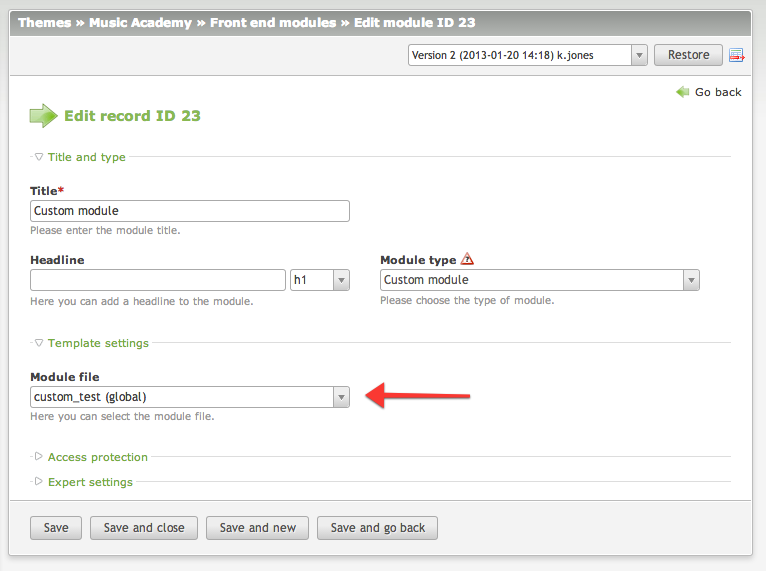

# Custom Module extension for Contao Open Source CMS

Custom Module is an extension for the [Contao Open Source CMS](https://contao.org).

Contao extension that allows you to include a custom file as a module. 
It is especially helpful when you need to use the PHP code or create a reusable content.

## Documentation

[Read the documentation](docs/README.md)

## Copyright

This project has been created and is maintained by [Codefog](https://codefog.pl).
