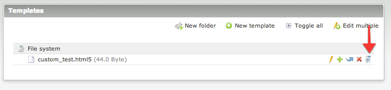
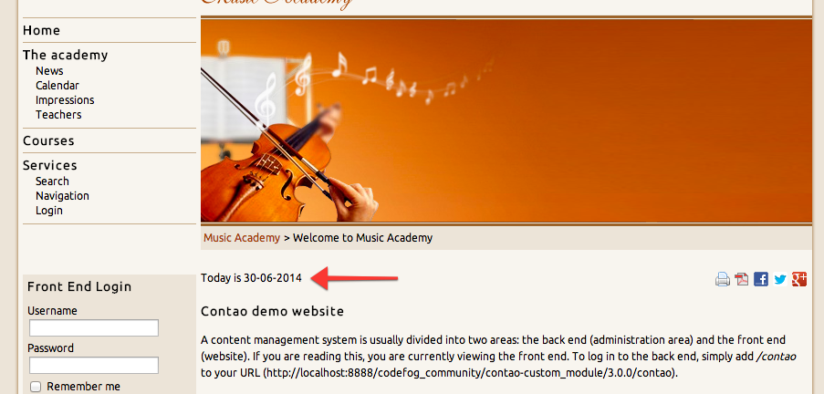

# Custom Module – Documentation

## Create a template

To create a new template that can be attached as front end module, please go to the `Templates` module and create a new 
`custom_default` template. Rename it according to its purpose. Then, create a front end module and choose 
the appropriate template.



Put it online on your website and check the result:



## Example usage

As an example, let's display a hello message to the user. If he is not logged in, then we'll say hello to guest 
and encourage him to sign in. If he is already logged in, we'll simply say hello with his name:

```php
<?php if (FE_USER_LOGGED_IN): ?>
Hello {{user::firstname}}!
<?php else: ?>
Hello guest! Would you like to {{link_open::123}}sign in{{link_close}}?
<?php endif; ?>
```
